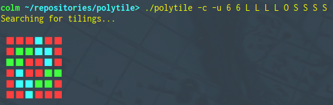
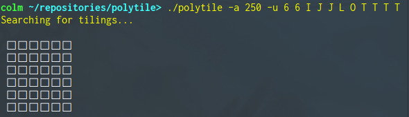
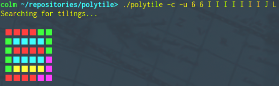

# polytile

A Haskell program for tiling one-sided [polyominoes](https://en.wikipedia.org/wiki/Polyomino) on a rectangular grid.
The program is capable of handling any polyomino, simply representing them as sets of coordinates internally, but currently only accepts the seven one-sided tetrominos (polyominos of size four) from the command-line.

I originally wrote this because I thought that writing it would be a more interesting puzzle than the sigil tiling puzzles in [The Talos Principle](http://www.croteam.com/talosprinciple/).
I've included a Bash script, `talos.sh`, that will run `polytile` on all sigil puzzles from the game.

## Usage

```
./polytile [-a milliseconds] [-c] [-u] <width> <height> <polyominoes...>
```

For best results, if your terminal will allow it, set the `-c` option to output ANSI colour codes, allowing the output to be condensed into a single drawing, and set the `-u` option to output Unicode characters.



The output can also be animated with the `-a` option, specifying the number of milliseconds to delay between updates to the drawing. Setting `-a` implies `-c`.



## Polyominoes

* I

```
 □ □ □
 □ ■ □
 □ ■ □
 □ ■ □
 □ ■ □
 □ □ □
```

* J

```
 □ □ □ □
 □ □ ■ □
 □ □ ■ □
 □ ■ ■ □
 □ □ □ □
```

* L

```
 □ □ □ □
 □ ■ □ □
 □ ■ □ □
 □ ■ ■ □
 □ □ □ □
```

* O

```
 □ □ □ □
 □ ■ ■ □
 □ ■ ■ □
 □ □ □ □
```

* S

```
 □ □ □ □ □
 □ □ ■ ■ □
 □ ■ ■ □ □
 □ □ □ □ □
```

* T

```
 □ □ □ □ □
 □ ■ ■ ■ □
 □ □ ■ □ □
 □ □ □ □ □
```

* Z

```
 □ □ □ □ □
 □ ■ ■ □ □
 □ □ ■ ■ □
 □ □ □ □ □
```

## Notes

#### Generated colourings will not always be minimal:

[The four-colour theorem](https://en.wikipedia.org/wiki/Four_color_theorem) ensures that there will always be a four-colouring for any tiling, and while there do exist polynomial-time algorithms to find such colourings, these are complex, requiring the checking of hundreds of cases.
The colouring algorithm implemented here is both simple and efficient, but may sometimes admit colourings that use more colours than are necessary:



The maximum number of colours that I've observed the algorithm to use is currently six.
Please let me know if you find an example where the algorithm needs more than this.
