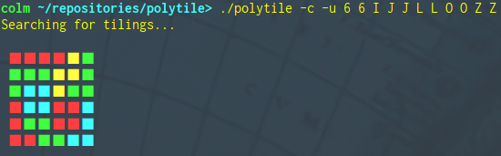
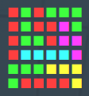

# polytile

A command-line Haskell program for tiling one-sided [polyominoes](https://en.wikipedia.org/wiki/Polyomino) on a rectangular grid.
The program is capable of handling any polyomino, simply representing them as sets of coordinates internally, but currently only accepts the seven one-sided tetrominos (polyominos of size four) from the command-line.

I originally wrote this to solve the sigil tiling puzzles in [The Talos Principle](http://www.croteam.com/talosprinciple/).
I've included a Bash script, `talos.sh`, that will run `polytile` on all sigil puzzles from the game.
The script just needs to be pointed to the location of the executable through its `exe` varible; by default, this can be passed as the first command-line argument.

## Usage

```
./polytile [-a milliseconds] [-c] [-u] <width> <height> <polyominoes...>
```

For best results, if your terminal will allow it, set the `-c` option to output ANSI colour codes, allowing the output to be condensed into a single drawing, and set the `-u` option to output Unicode characters.



The search can also be animated with the `-a` option, specifying the number of milliseconds to delay between each update to the drawing.
Setting `-a` implies `-c`.


## Algorithm

The tiling algorithm is brute-force, generating all unique rotations and permutations of the given polyominoes.
For each permutation, the polyominoes are traversed in order, attempting to place each in the leftmost-uppermost available space; if one doesn't fit, either because it falls outside the grid's boundary or it overlaps with an already placed polyomino, try again with the next permutation.

A naive implementation of the algorithm just described would be intolerably slow, however.
The algorithm is optimised by generating the permutations as a [rose tree](https://en.wikipedia.org/wiki/Rose_tree) of partial-tilings which is [lazily](https://en.wikipedia.org/wiki/Lazy_evaluation) consumed.
The root of the tree represents an empty grid, no polyominoes having been placed, and each child node has one more polyomino successfully placed than its parent.
When a polyomino doesn't fit, rather than starting the next permutation from the empty grid, we can backtrack, attempting to place a different polyomino into the parent node's grid.
The animation command-line option visualises this depth-first search.

## Polyominoes

* I

```
 □ □ □
 □ ■ □
 □ ■ □
 □ ■ □
 □ ■ □
 □ □ □
```

* J

```
 □ □ □ □
 □ □ ■ □
 □ □ ■ □
 □ ■ ■ □
 □ □ □ □
```

* L

```
 □ □ □ □
 □ ■ □ □
 □ ■ □ □
 □ ■ ■ □
 □ □ □ □
```

* O

```
 □ □ □ □
 □ ■ ■ □
 □ ■ ■ □
 □ □ □ □
```

* S

```
 □ □ □ □ □
 □ □ ■ ■ □
 □ ■ ■ □ □
 □ □ □ □ □
```

* T

```
 □ □ □ □ □
 □ ■ ■ ■ □
 □ □ ■ □ □
 □ □ □ □ □
```

* Z

```
 □ □ □ □ □
 □ ■ ■ □ □
 □ □ ■ ■ □
 □ □ □ □ □
```

## Notes

#### Generated colourings will not always be minimal:

[The four-colour theorem](https://en.wikipedia.org/wiki/Four_color_theorem) ensures that there will always be a four-colouring for any tiling, and while there do exist polynomial-time algorithms to find such colourings, these are complex, requiring the checking of hundreds of cases.
The colouring algorithm implemented here is both simple and efficient, but may sometimes admit colourings that use more colours than are necessary:



The maximum number of colours that I've observed the colouring algorithm using is currently six.
Please let me know if you find an example which requires more than this.
